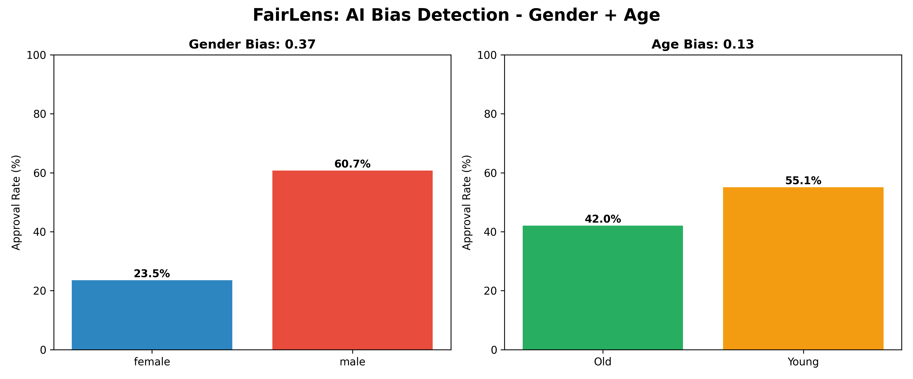

# FairLens - AI Bias Detector

**Problem**: Banks use AI for loans but the AI discriminates by gender and age.

**Solution**: FairLens scans any AI model and flags bias using Microsoft's Fairlearn.

**Demo Results**: 
- Gender Bias Score: 0.37 = HIGH RISK | Female: 23.5% vs Male: 60.7%
- Age Bias Score: 0.13 = HIGH RISK | Old: 42.0% vs Young: 55.1%
- EU AI Act threshold: 0.10. This model violates it on both metrics.

**How to run**:
1. pip install pandas fairlearn matplotlib
2. python bias_check.py

**Tech**: Python, Pandas, Fairlearn, Matplotlib  
**Built for**: [GDG Solution Challenge 2026] 2026
